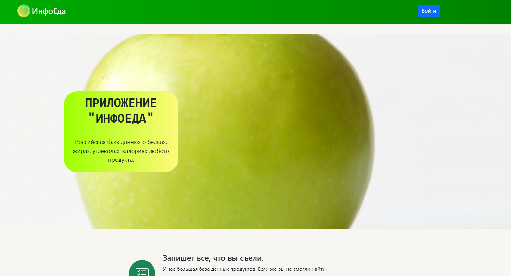

# Xchronoeat - Локальный Django сайт для управления базой данных продуктов 🍎🥗

[](https://opensource.org/licenses/MIT)


## 📖 О проекте

Xchronoeat - это локальный Django веб-сайт, предназначенный для удобного взаимодействия с базой данных, содержащей около 6000 продуктов питания.  Проект предоставляет интуитивно понятный интерфейс для поиска, добавления, редактирования и удаления продуктов, а также другие полезные функции для управления данными о питании.  Он идеально подходит для личного использования, диетологов, разработчиков приложений, связанных с питанием, и всех, кто хочет легко управлять большой базой данных продуктов.

**Основные особенности:**

*   **Большая база данных:** Включает в себя около 6000 продуктов питания с подробной информацией (название, пищевая ценность и т.д.).
*   **Интуитивно понятный интерфейс:**  Django Admin и/или пользовательский интерфейс для легкого управления продуктами.
*   **Поиск и фильтрация:**  Быстрый и эффективный поиск продуктов по названию и другим критериям.
*   **Добавление, редактирование и удаление:**  Полный CRUD (Create, Read, Update, Delete) для управления базой данных.
*   **Локальное развертывание:** Простая установка и запуск на вашем локальном компьютере.
*   **Расширяемость:** Легко расширяемый и настраиваемый с помощью Django.

## 🖼️ Демонстрация




## 🛠️ Установка

Следуйте этим инструкциям, чтобы настроить и запустить Xchronoeat на вашем локальном компьютере.

**Предварительные требования:**

*   Python 3.8 или новее
*   Pip (установлен вместе с Python)
*   Git (опционально, для клонирования репозитория)

**Шаги установки:**

1.  **Клонируйте репозиторий (или скачайте ZIP):**

    ```bash
    git clone https://github.com/TchTech/Xchronoeat
    cd Xchronoeat
    ```

    Если вы скачали ZIP-архив, распакуйте его в удобную папку.

2.  **Создайте виртуальное окружение (рекомендуется):**

    ```bash
    python -m venv venv
    ```

    Активируйте виртуальное окружение:

    *   **Windows:**

        ```bash
        venv\Scripts\activate
        ```

    *   **macOS/Linux:**

        ```bash
        source venv/bin/activate
        ```

3.  **Установите зависимости:**

    ```bash
    pip install -r requirements.txt
    ```

4.  **Примените миграции:**

    ```bash
    python manage.py migrate
    ```

5.  **Создайте суперпользователя (для доступа к Django Admin):**

    ```bash
    python manage.py createsuperuser
    ```

    Вам будет предложено ввести имя пользователя, email и пароль.

6.  **Загрузите данные в базу данных (если необходимо):**

    *Если у вас есть файл с данными (например, CSV или JSON), используйте скрипт для загрузки данных в базу данных.*  Пример (если у вас есть `data.json`):

    ```bash
    python manage.py loaddata data.json
    ```
    *Или, если вы используете свой скрипт:*
    ```bash
    python manage.py load_data_script.py
    ```
    *Укажите путь к вашему скрипту и файлу данных.*

7.  **Запустите Django development server:**

    ```bash
    python manage.py runserver
    ```

    Откройте ваш браузер и перейдите по адресу `http://127.0.0.1:8000/` (или адресу, указанному в консоли).

## 🚀 Использование

*   **Django Admin:**  Для управления продуктами используйте Django Admin (доступен по адресу `http://127.0.0.1:8000/admin/`).  Войдите, используя учетные данные суперпользователя, созданные на шаге 5.
*   **Пользовательский интерфейс (если разработан):** Если вы разработали пользовательский интерфейс, используйте его для поиска и просмотра продуктов.


## ⚙️ Настройка

*   **`Xchronoeat/settings.py`:**  Настройте параметры базы данных, часовой пояс, языковые настройки и другие параметры проекта.
*   **`food/models.py`:**  Определите структуру данных о продуктах (поля, типы данных и т.д.).
*   **`food/admin.py`:** Настройте отображение моделей в Django Admin.
*   **`food/views.py` и `food/urls.py`:** Создайте свой пользовательский интерфейс для взаимодействия с базой данных.

## 🤝 Вклад

Приветствуются любые вклады в проект!  Если у вас есть идеи, предложения или исправления, пожалуйста:

1.  Форкните репозиторий
2.  Создайте новую ветку с вашими изменениями (`git checkout -b feature/my-new-feature`)
3.  Сделайте коммиты с описанием ваших изменений (`git commit -am 'Add some feature'`)
4.  Запуште ветку на GitHub (`git push origin feature/my-new-feature`)
5.  Создайте Pull Request

## 📜 Лицензия

Этот проект распространяется под лицензией MIT - см. файл [LICENSE](LICENSE) для получения подробной информации.
